# SundariSaj Bridal Collection - Application Flow Diagrams

## 1. User Authentication Flow

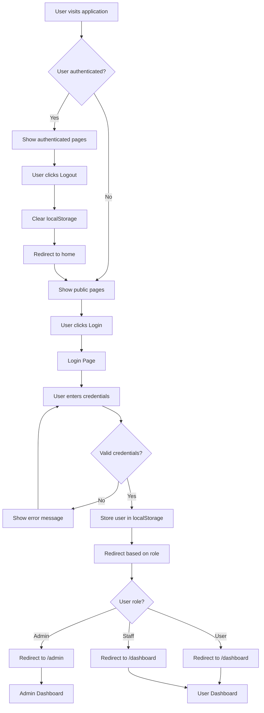

## 2. Product Browsing Flow

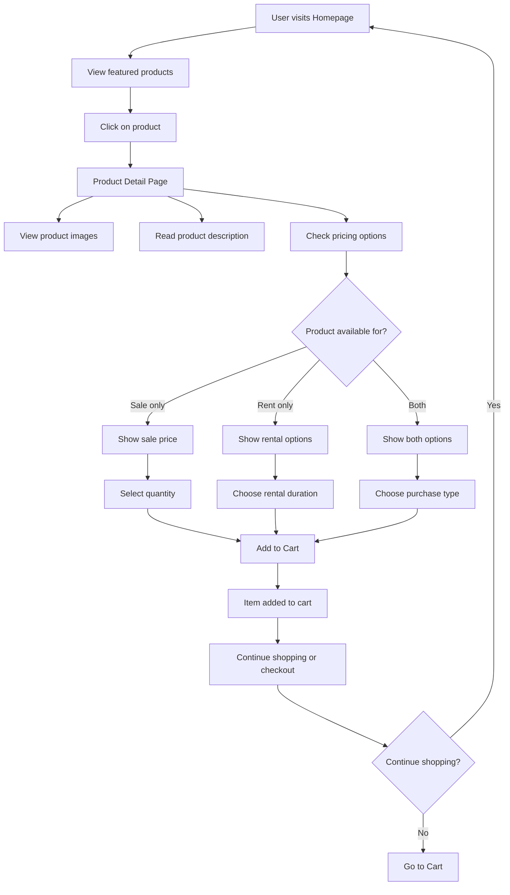

## 3. Shopping Cart Flow

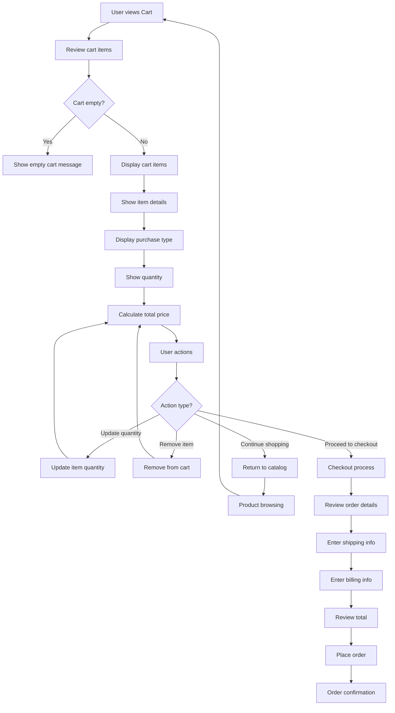

## 4. Admin Dashboard Flow

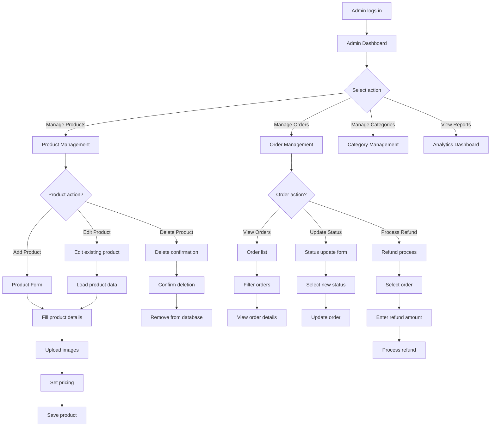

## 5. User Dashboard Flow

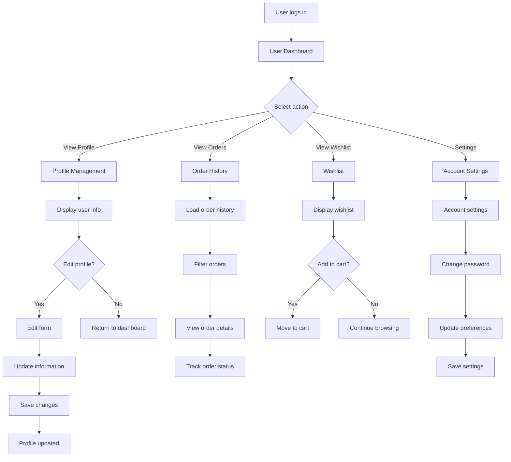

## 6. Product Search and Filtering Flow

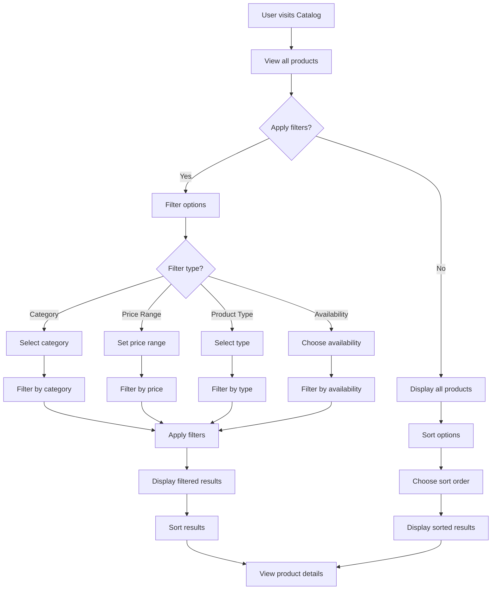

## 7. Order Processing Flow

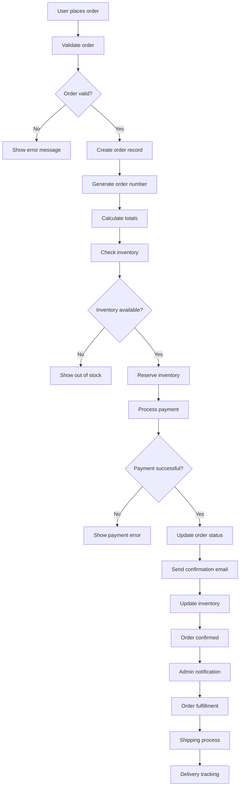

## 8. Payment Processing Flow

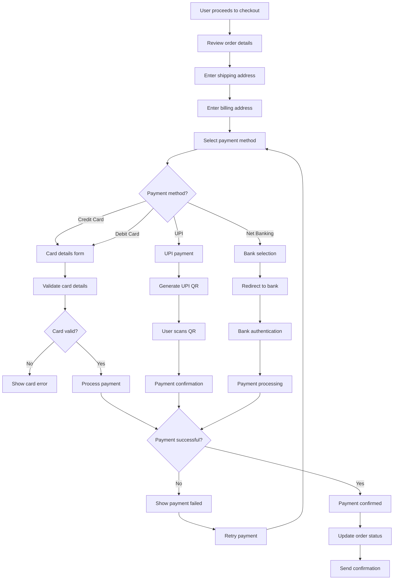

## 9. Inventory Management Flow

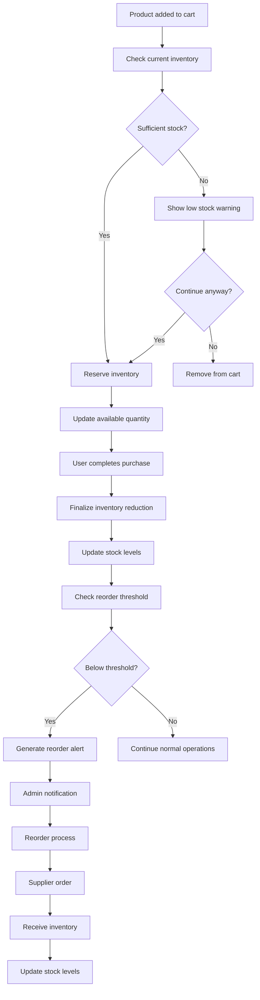

## 10. User Registration Flow

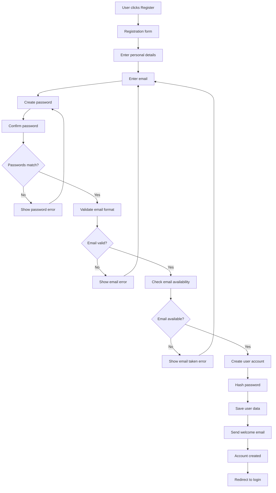

## 11. Error Handling Flow

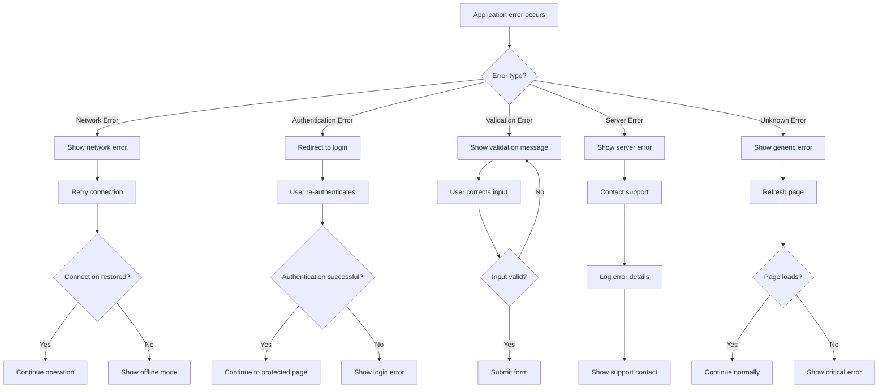

## 12. Data Persistence Flow

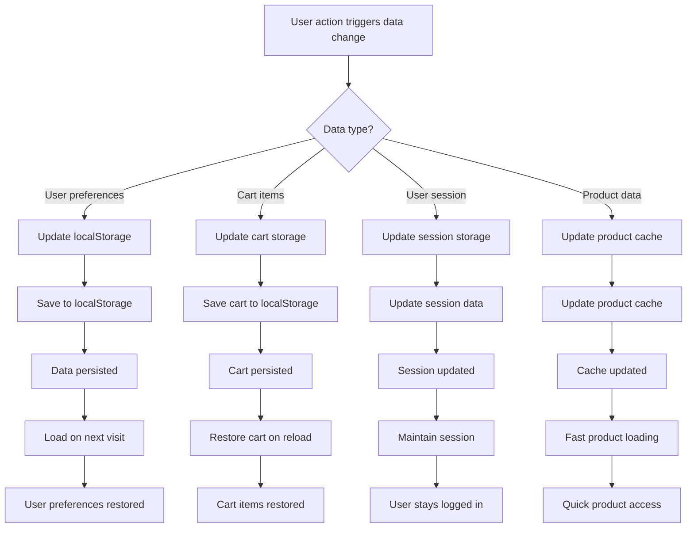

These flow diagrams provide a comprehensive overview of all major application flows, helping developers understand the user journey and system interactions throughout the SundariSaj Bridal Collection e-commerce platform. 